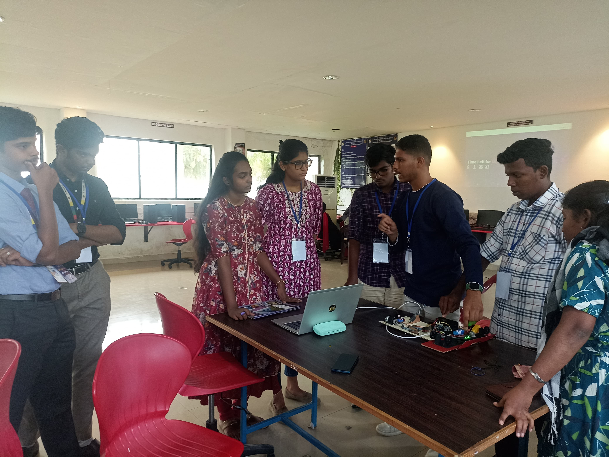

# 🚌 ABBS System (Advanced Bus Boarding Safety System)

## 🚀 Project Overview

The **Advanced Bus Boarding Safety (ABBS) System** is an innovative mechanism designed to prevent **bus foot boarding accidents**, a critical safety concern in urban transit. Unlike traditional door systems, ABBS targets the **primary cause** — unsafe boarding from the **last step of the bus staircase** — through a tech-forward, multi-component solution that improves safety, accessibility, and efficiency.

---

## 🎯 Objective

To **reduce bus foot boarding incidents** by introducing a smart mechanical and sensory system that:
- Prevents boarding while the bus is in motion or unsafe
- Assists **senior citizens and children** with easier boarding
- Enhances safety using **dual clutch control**, **motion sensors**, and **indicator alerts**

---

## 🛠️ Key Features

- **🧠 Dual Clutch System**  
  - One clutch is driver-controlled  
  - The second is activated via **hydraulic pressure** when motion is detected on the staircase

- **🎯 Motion Sensor Activation**  
  - Detects when a passenger steps on the staircase  
  - Automatically engages the clutch to prevent movement and initiate safety response

- **🔔 Indicator Lights & Alarm System**  
  - Powered by a controller chip  
  - Visually and audibly signals the presence of passengers

- **📉 Foldable Secondary Staircase**  
  - Deploys to bridge the height between bus and ground  
  - Specially designed for **elderly and children**

# Flow chart

---

## 🌍 Alignment with UN Goals

### Goal: **Sustainable Cities and Communities**
- Promotes **safer urban mobility**
- Supports **inclusive transport systems**
- Reduces accident-related **emissions and delays**

---

## 💡 Why ABBS Stands Out

- Directly tackles the **core issue** of boarding from low stairs
- Integrates a **complete safety system** combining:
  - Mechanical engineering
  - Sensor technology
  - Ergonomic design
- Reduces the risk of **accidents**, **traffic disruption**, and **emergency response needs**
- Encourages **eco-conscious urban living** by minimizing avoidable emissions and delays

---

## 🌱 Societal & Environmental Impact

- **Prevents injuries** and improves commuter confidence
- **Eases burden** on healthcare and transit emergency services
- **Reduces emissions** from accident-related congestion
- Contributes to **cleaner air** and better quality of life in cities

---

## 🧪 Future Scope & Considerations

- **Sensor reliability** and hydraulic system durability will be refined through iterative prototyping
- Scalability across different bus types and geographic regions
- Possible integration with **smart bus systems** and **IoT monitoring**

---
# Prototype

## 📽️ Demo Video

🔗 [Watch the prototype in action](#) *(Insert YouTube/Drive/Unlisted video link here)*

---

## 📬 Contact

For collaboration, feedback, or showcasing opportunities:

**Name:** *[Fiaz Khan]*   
**LinkedIn:** *[https://www.linkedin.com/in/mr-5azkon]*

---

> ⚠️ *Note: This project is currently not patented. Unauthorized commercial use or replication without consent is discouraged. All rights reserved to the project developer.*

